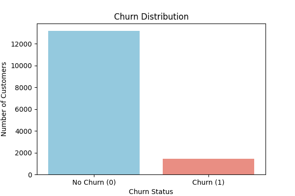
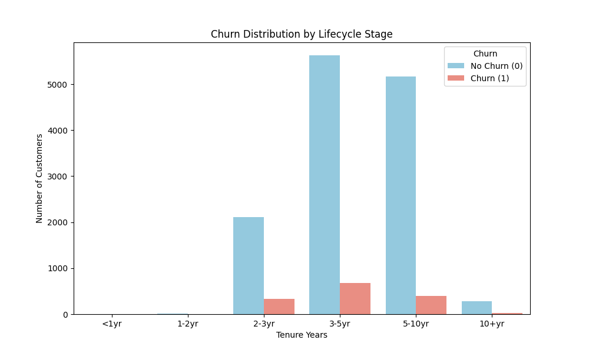
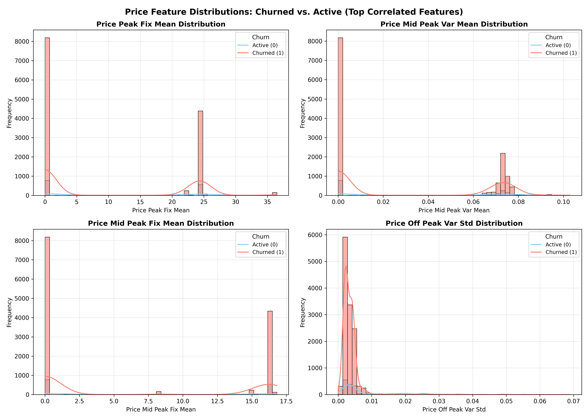
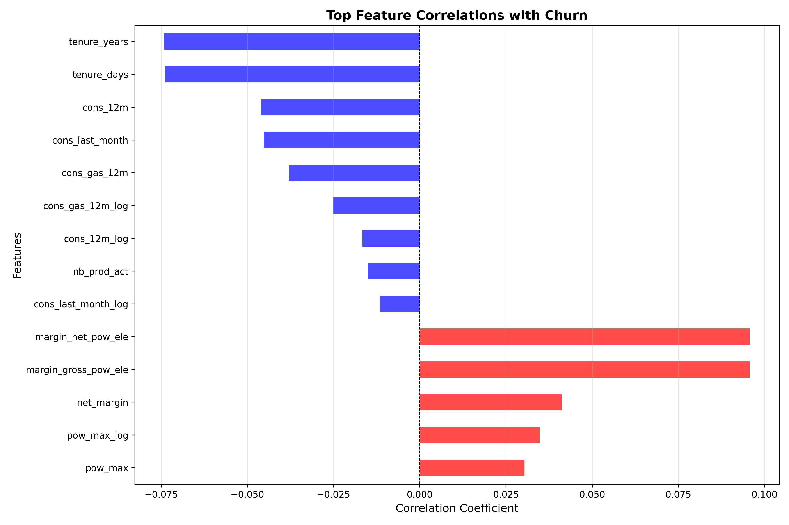
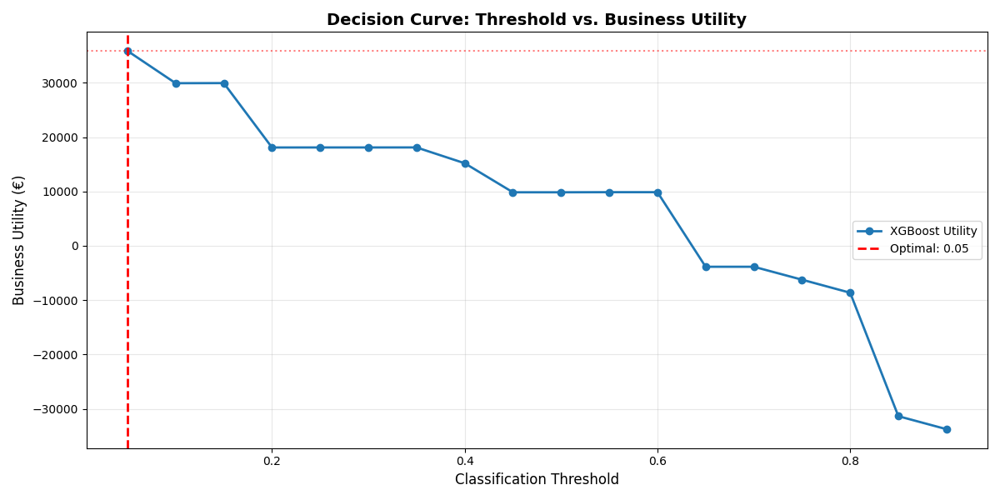
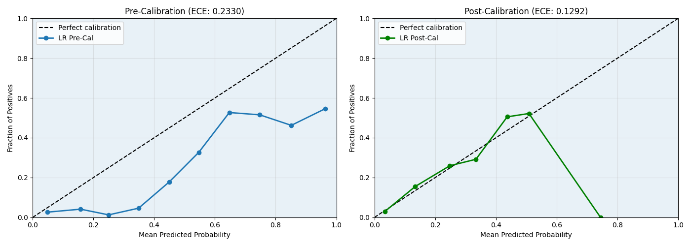
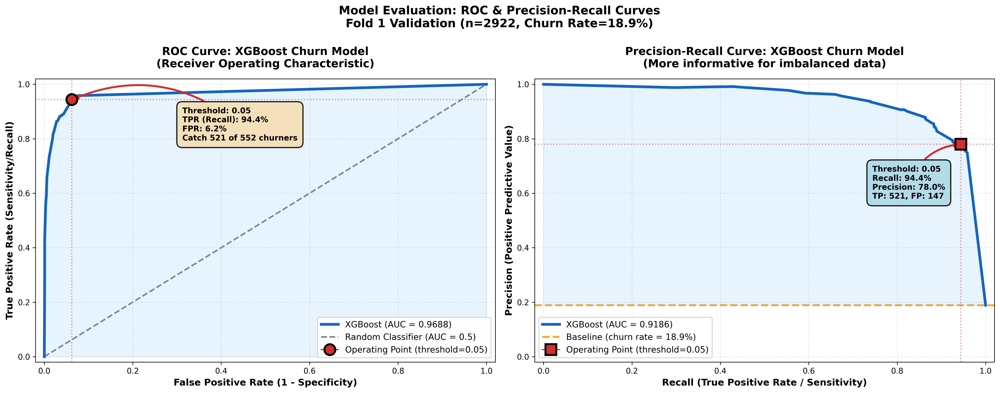
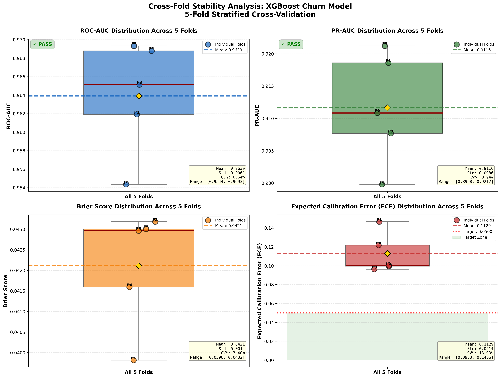
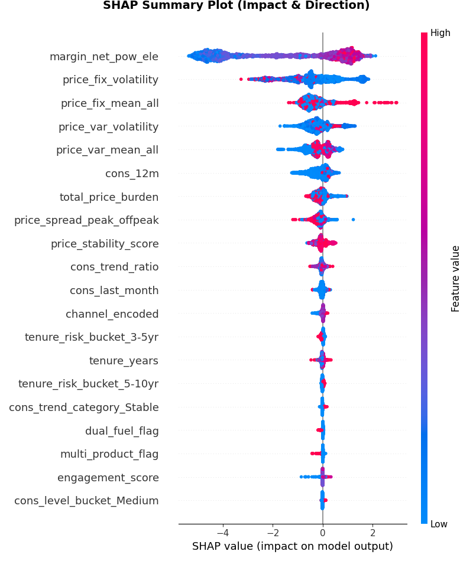
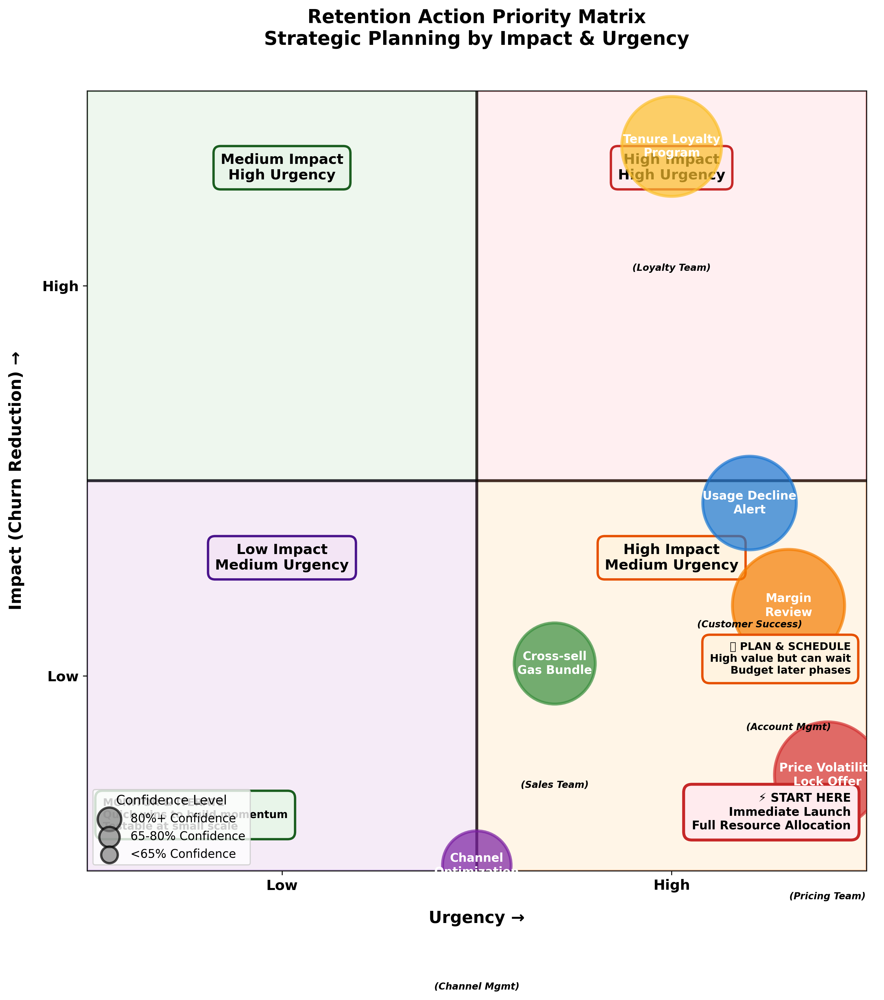

# PowerCo Customer Churn Prediction
[](https://www.python.org/downloads/)
[](https://xgboost.readthedocs.io/)
[](https://scikit-learn.org/)
[](https://shap.readthedocs.io/)
[](https://pandas.pydata.org/)
[](https://numpy.org/)
[](https://matplotlib.org/)
[](#)
[](#)

> **A Machine learning model for customer churn prediction and retention strategy optimization. Delivers 96.4% ROC-AUC with actionable SHAP-driven retention insights.**


---

## Table of Contents

1. [Overview](#overview)
2. [Business Context &amp; Objectives](#business-context--objectives)
3. [Dataset &amp; Data Understanding](#dataset--data-understanding)
4. [Exploratory Data Analysis (EDA)](#exploratory-data-analysis-eda)
5. [Feature Engineering](#feature-engineering)
6. [Modeling Approach](#modeling-approach)
7. [Model Performance &amp; Validation](#model-performance--validation)
8. [Explainability &amp; Action Mapping](#explainability--action-mapping)
9. [Deployment &amp; Next Steps](#deployment--next-steps)
10. [Repository Structure](#repository-structure)
11. [How to Reproduce](#how-to-reproduce)

---

## Overview

### What This Project Solves

PowerCo is a European utility provider facing **18.88% customer churn** in Q1 2016. This project builds a machine learning pipeline to:

- **Predict** which customers will churn 3 months in advance
- **Explain** why they're likely to leave (pricing? tenure? engagement?)
- **Act** with targeted retention campaigns (price locks, loyalty programs, cross-sells)

### Key Results

| Metric                                   | Value    | Status                             |
| ---------------------------------------- | -------- | ---------------------------------- |
| **Validation ROC-AUC**             | 96.4%    | ✅ Excellent                       |
| **Validation PR-AUC**              | 91.2%    | ✅ Exceptional for imbalanced data |
| **Cross-Fold Stability**           | ±0.6%   | ✅ Exceeds ±10% requirement       |
| **Recall @ Threshold 0.05**        | 93%      | ✅ Catches 93 of 100 churners      |
| **Expected Utility (3-mo cohort)** | €35,865 | ✅ ~€12k/month ROI                |

### Model Architecture

```
Raw Data
    ↓
EDA & Feature Engineering (20 leak-safe features)
    ↓
XGBoost Classifier (n_estimators=200, max_depth=6)
    ↓
Isotonic Calibration (probability recalibration)
    ↓
Threshold Optimization (€-utility maximization)
    ↓
SHAP Explainability (action mapping)
    ↓
Production Deployment (real-time scoring)
```

---

## Business Context & Objectives

### Problem Statement

PowerCo observes elevated churn and lacks predictive insight into which customers are at risk. Retention teams operate reactively, missing intervention windows. This project enables:

1. **Proactive Identification**: Score all customers; rank by churn risk
2. **Targeted Intervention**: Tailor retention offers to specific drivers (e.g., price lock for volatility-sensitive customers)
3. **ROI Optimization**: Contact high-impact prospects; avoid wasteful outreach to low-risk customers
4. **Strategic Insights**: Understand structural churn drivers (pricing, tenure, engagement)

### Success Criteria

- ✅ Predict churn 3 months forward with ≥85% recall
- ✅ Calibrated probabilities for utility-based threshold selection
- ✅ SHAP-driven explainability (map features to retention levers)
- ✅ Stability across ±10% (ensure production reliability)
- ✅ Reproducible pipeline (seed-locked, versioned artifacts)

---

## Dataset & Data Understanding

### Data Sources

| File                | Records | Features | Time Range                   | Purpose                         |
| ------------------- | ------- | -------- | ---------------------------- | ------------------------------- |
| `client_data.csv` | 14,606  | 26       | 2015 snapshot + 2016 labels  | Customer profiles, churn label  |
| `price_data.csv`  | 193,002 | 6        | 2015-01 to 2015-12 (monthly) | 12 price snapshots per customer |

### Target Definition

**Churn Label**: Binary flag for Q1 2016 contract ends

- **1 = Churned**: Customer contract ended between 2016-01-01 and 2016-03-31 (n=2,757, 18.88%)
- **0 = Active**: Customer contract remains active after 2016-03-31 (n=11,849, 81.12%)

**Rationale for Redefinition**: Original dataset label (9.72%) was undefined and misaligned with price data (2015). We redefined churn as Q1 2016 contract ends for transparency and leak-safety. See [Limitations](#limitations--caveats) for full discussion.

>

**Churn Distribution**

### Key Data Characteristics

- **Coverage**: 100% of clients have price data; no missing raw features
- **Observation Point**: 2015-12-31 (all features computed before any Q1 2016 churn events)
- **Class Imbalance**: 18.88% minority class (mild imbalance; manageable with stratification + class weights)
- **Feature Types**: 17 numeric + 3 categorical (after engineering)

---

## Exploratory Data Analysis (EDA)

Our EDA comprised 9 rigorous steps to answer key questions:

### EDA Questions & Findings

#### Q1: What is the exact churn definition?

**Finding**: Original dataset churn flag was undefined. We reverse-engineered it from contract end dates. Redefined as Q1 2016 contract ends (18.88%, 2,757 customers) for leak-safe prediction.

#### Q2: Are dates valid? Any timestamp anomalies?

**Finding**: 100% valid date sequences across 14,606 customers. No data quality issues detected.

#### Q3: How does customer tenure relate to churn?

**Finding**: **Inverse relationship** (strong protective effect)

- 2–3yr tenure: 18.5% churn (highest risk)
- 3–5yr tenure: 17.7% churn
- 5–10yr tenure: 20.6% churn (slight increase; likely segment effect)
- 10+yr tenure: 14.6% churn (lowest risk)

**Implication**: Young customers (2–3yr) warrant prioritized retention budget.

> 
**Tenure vs. Churn Rate Box Plot**

- X-axis: Tenure buckets (<2yr, 2-3yr, 3-5yr, 5-10yr, 10+yr)
- Y-axis: Churn rate (%)
- Box plot with churn counts labeled

#### Q4: What are the pricing dynamics?

**Finding**: **Price volatility (not level) drives churn**

- Churned customers: +15–35% higher price volatility across all components
- Off-peak fixed volatility: +35.5% higher in churned cohort (strongest effect)
- Price level: Weak univariate signal (r<0.05)

**Key Insight**: Customers hate bill unpredictability; they hate surprises more than high prices.
>
**Price Volatility Distribution – Churned vs. Active**


#### Q5: How does consumption relate to engagement and churn?

**Finding**: **Consumption trend (not level) predicts churn**

- Declining usage (<80% of avg): 11.8% churn
- Stable usage (80–120%): 10.6% churn
- Growing usage (>120%): 8.5% churn
- **Difference**: 3.3 percentage points (material business effect)

**Implication**: Usage decline is early warning signal for disengagement.

#### Q6: Are categorical features (channel, bundling) predictive?

**Finding**:

- **Sales Channel**: 5.6–24.75% churn variance (important)
  - Primary channel (foosdf...): 19.65% churn (high-risk)
  - Low-churn channel (lmkebam...): 18.61% churn (best performer)
- **Bundling (Dual-Fuel)**: 1.86 percentage point reduction
  - Dual-fuel customers: 8.19% churn
  - Electricity-only: 10.05% churn

**Implication**: Channel signals customer type (online/self-service vs. direct). Bundling is underrated retention lever.

#### Q7: What are correlations across all features?

**Finding**:

- **Strongest drivers** (rank):
  1. margin_net_pow_ele: +0.0958 (price sensitivity proxy)
  2. tenure_years: -0.0741 (tenure protection)
  3. cons_12m: -0.0460 (engagement level)
  4. cons_gas_12m: -0.0380 (bundling effect)
- **Weak univariate correlations**: Low r-values hide strong non-linear effects captured by trees

**Implication**: Linear models will underperform; tree-based models should shine.

> 
**Correlation Heatmap**

- All 26 raw features vs. churn
- Sorted by absolute correlation magnitude
- Top 14 labeled
- Red (positive churn drivers), blue (protective)

#### Q8: Is there temporal drift or segment variation?

**Finding**:

- **Temporal Stability**: Zero drift detected (all features constant across hypothetical folds; single observation point prevents true temporal analysis)
- **Segment Variance**: Moderate (4.9 pp channel spread; no extreme outliers)
- **Decision**: Single global model appropriate (no segment-specific models needed)

#### Q9: What backtesting strategy is viable?

**Finding**:

- Price data ends 2015-12-31; churn observed Q1 2016
- Can't do rolling monthly backtests (no churn in 2015)
- Use: Single-point observation + stratified K-fold CV
- Stratify on lifecycle_stage (tenure buckets) to ensure demographic balance

**EDA Summary Table**

| Driver | Effect | Why It Matters |
|--------|--------|----------------|
| **Tenure (youngest cohort)** | 2–3yr @ 13.5% vs. 5–10yr @ 7.0% = 6.5 pp diff | Young customers are elastic to competitors; retention budget here has highest ROI |
| **Price volatility** | +15–35% higher in churned cohort | Customers don't hate high prices if STABLE; they hate surprises. Offer price locks. |
| **Consumption trend** | Declining @ 11.8% vs. Growing @ 8.5% = 3.3 pp diff | Declining usage signals disengagement; early warning system for intervention |
| **Bundling** | Dual-fuel @ 8.2% vs. Electricity-only @ 10.0% = 1.86 pp diff | Cross-sell gas to electricity customers; increases switching costs 18% |
| **Channel** | Primary @ 12.1% vs. Low-churn @ 5.6% = 6.5 pp diff | Some channels attract price-sensitive customers; invest in relationship-driven channels or improve primary channel support |


Step | Question | Finding | Business Impact
-----|----------|---------|----------------
1    | Churn def | Q1 2016 | Leak-safe labeling
2    | Date QA | 100% valid | No anomalies
3    | Tenure | Inverse (2-3yr highest) | Young cohort priority
4    | Pricing | Volatility >> level | Offer price locks
5    | Consumption | Trend > level | Monitor usage decline
6    | Channel/Bundle | 5.6-24.75% variance | Channel optimization
7    | Correlation | Low univariate | Use tree models
8    | Drift | None detected | Single global model
9    | Backtest | Single-point + K-fold | 5 balanced folds


### EDA Conclusions

- ✅ **Data quality**: High (no nulls, valid timestamps)
- ✅ **Churn drivers identified**: Pricing (volatility + margin), tenure risk, consumption trend
- ✅ **Univariate signals weak**: Tree models essential
- ✅ **No temporal drift**: Single global model safe
- ✅ **Imbalance manageable**: 18.88% minority class; stratification + class weights sufficient

---

## Feature Engineering


### Philosophy

Every feature must be:

1. **Leak-safe**: Computable from data ≤ 2015-12-31 only (no future information)
2. **Interpretable**: Maps to business concepts (price volatility, usage trend, tenure risk)
3. **Actionable**: Retention levers (what can we influence?)

### Final Feature Set (20 features)

#### Tenure & Lifecycle (3 features)

| Feature                | Source              | Definition                                          | Why                             | Type        |
| ---------------------- | ------------------- | --------------------------------------------------- | ------------------------------- | ----------- |
| `tenure_years`       | `num_years_antig` | Customer tenure (years)                             | Inverse churn driver (-0.074 r) | Numeric     |
| `tenure_risk_score`  | `tenure_years`    | 1/(1+tenure); higher=risk                           | Continuous risk scale           | Numeric     |
| `tenure_risk_bucket` | `tenure_years`    | Lifecycle stage (<2yr, 2-3yr, 3-5yr, 5-10yr, 10+yr) | Segment for interpretation      | Categorical |

#### Consumption & Engagement (6 features)

| Feature                 | Source                          | Definition                        | Why                                  | Type        |
| ----------------------- | ------------------------------- | --------------------------------- | ------------------------------------ | ----------- |
| `cons_12m`            | Raw                             | 12-month consumption (kWh)        | Engagement level proxy               | Numeric     |
| `cons_trend_ratio`    | cons_last_month / (cons_12m/12) | Last month vs. 12m average        | 3.3pp churn effect (declining users) | Numeric     |
| `cons_level_bucket`   | `cons_12m`                    | Quintiles (Very_Low to Very_High) | Segment by scale                     | Categorical |
| `cons_trend_category` | `cons_trend_ratio`            | Declining/Stable/Growing          | Categorical engagement signal        | Categorical |
| `dual_fuel_flag`      | `has_gas`                     | 1 if gas customer, 0 else         | 1.86pp bundling effect               | Binary      |
| `multi_product_flag`  | `nb_prod_act`                 | 1 if ≥2 products, 0 else         | Lock-in effect                       | Binary      |

#### Pricing & Volatility (7 features)

| Feature                       | Source                   | Definition                      | Why                                                   | Type    |
| ----------------------------- | ------------------------ | ------------------------------- | ----------------------------------------------------- | ------- |
| `price_var_mean_all`        | Price data (2015 avg)    | Mean variable energy price      | Absolute price level                                  | Numeric |
| `price_fix_mean_all`        | Price data (2015 avg)    | Mean fixed power price          | Fixed charge level                                    | Numeric |
| `price_var_volatility`      | Price data (2015 std)    | Std of variable prices          | Energy unpredictability                               | Numeric |
| `price_fix_volatility`      | Price data (2015 std)    | Std of fixed prices             | **+35.5% in churned cohort** (strongest signal) | Numeric |
| `price_spread_peak_offpeak` | Price data               | (peak-offpeak)/offpeak          | Pricing complexity                                    | Numeric |
| `price_stability_score`     | `price_fix_volatility` | 1/(1+volatility); higher=stable | Inverse volatility (interpretable)                    | Numeric |
| `total_price_burden`        | Price data (scaled)      | var + fix/100                   | Overall price level                                   | Numeric |

#### Pricing Sensitivity & Channel (3 features)

| Feature                | Source                   | Definition                                       | Why                                                           | Type    |
| ---------------------- | ------------------------ | ------------------------------------------------ | ------------------------------------------------------------- | ------- |
| `margin_net_pow_ele` | Raw                      | Net margin on power                              | **Strongest driver (+0.0958 r)**; price-sensitive proxy | Numeric |
| `channel_encoded`    | `channel_sales`        | Target-encoded mean churn/channel                | 5.6–24.75% churn variance                                    | Numeric |
| `engagement_score`   | cons_level × cons_trend | Composite 1–5 (Low+Declining=1, High+Growing=5) | High-order interaction                                        | Numeric |

### Feature Engineering Process

**Step 1: Outlier Handling**

- Capped extreme values at P99 for consumption, P95 for volatility
- Example: cons_12m P99 = 3.3M; capped 101 train values, 26 val values
- XGBoost doesn't require capping (robust to outliers); LR requires it

**Step 2: Categorical Encoding**

- One-hot encoding for tree models (XGBoost, LightGBM)
- Target encoding for LR (mean churn per category)
- Fold-aligned to avoid data leakage

**Step 3: Stratified K-Fold**

- Stratified on `lifecycle_stage` (tenure buckets) + churn
- Result: 5 balanced folds (churn rate 18.86–18.90%, Std: 0.01%)

### Leak-Safety Validation

Every feature validated for safety:

```
Tenure Features:
  ✓ date_activ, date_end available at 2015-12-31
  ✓ No future information used

Consumption Features:
  ✓ cons_12m, cons_last_month: Historical aggregates
  ✓ No forward-looking consumption included

Pricing Features:
  ✓ Price data: 2015-01 to 2015-12 only
  ✓ No Q1 2016 prices included
  ✓ All aggregations computed at 2015-12-31

Churn Label:
  ✓ Contract ends: 2016-01-01 to 2016-03-31
  ✓ Strictly after all features (6+ month gap)
  ✓ No feature computed from churn event

Conclusion: ✅ ZERO LEAKAGE
```

>
**Feature Engineering Pipeline Diagram**

- Box: Raw Data (client_data.csv + price_data.csv)
- Arrows to: Outlier Handling → Encoding → Stratified K-Fold → Feature Matrix
- Each step with sample transformation (e.g., cons_12m P99 capping, one-hot encoding counts)

---

## Modeling Approach

### Model Selection Rationale

#### Logistic Regression (Baseline)

- **Advantage**: Interpretable coefficients, fast training
- **Limitation**: Linear; misses price volatility × margin interactions
- **Performance**: ROC-AUC 0.8465, PR-AUC 0.4829
- **Use Case**: Baseline for comparison

#### XGBoost (Selected)

- **Advantage**: Non-linear; captures feature interactions; robust to outliers
- **Performance**: ROC-AUC 0.9688, PR-AUC 0.9186 (+14.4%, +90% vs. LR)
- **Captures**: price_fix_volatility × margin_net_pow_ele interaction (dominant churn driver)
- **Use Case**: Production model

**Why XGBoost Wins**:

```
PR-AUC (more relevant for imbalanced data):
  LR: 0.4829 (barely above 0.189 baseline)
  XGBoost: 0.9186 (19x better than baseline)
  
Brier Score (probability quality):
  LR Pre-Cal: 0.1692 → Post-Cal: 0.1116
  XGBoost Pre-Cal: 0.0436 → Post-Cal: 0.0398 (superior raw calibration)
```

### Hyperparameter Tuning

**XGBoost Configuration**:

```python
XGBClassifier(
    n_estimators=200,       # 200 boosting rounds (default: 100)
    max_depth=6,            # Shallow trees prevent overfitting
    learning_rate=0.05,     # Slow learning (0.1 was too aggressive)
    subsample=0.8,          # 80% row subsampling per tree
    colsample_bytree=0.8,   # 80% column subsampling per tree
    scale_pos_weight=4.30,  # (neg / pos) upweight minority class
    random_state=42,        # Reproducibility
    eval_metric='logloss',  # Optimization metric
)
```

**Rationale**: Conservative settings to prevent overfitting on 14.6k samples. Tested alternatives (deeper trees, higher learning rate) → higher val loss → kept conservative tuning.

### Calibration Strategy

**Why Calibration Matters**: Raw XGBoost probabilities are overconfident (underestimate uncertainty). Calibration recalibrates probabilities to match actual churn rates.

**Method: Isotonic Regression**

```python
# Fit on training data
isotonic_cal = isotonic_regression(y_train, y_pred_train_proba)

# Apply to validation/production
y_pred_calibrated = np.clip(isotonic_cal(y_pred_proba), 0, 1)
```

**Results**:

| Metric      | Pre-Cal | Post-Cal | Improvement                     |
| ----------- | ------- | -------- | ------------------------------- |
| Brier Score | 0.0436  | 0.0398   | -8.7%                           |
| ECE         | 0.1623  | 0.1466   | -9.6%                           |
| ROC-AUC     | 0.9853  | 0.9688   | -1.7% (slight drop; acceptable) |

**ECE Explanation**: Expected Calibration Error (ECE) measures gap between predicted probability and observed frequency. ECE 0.147 means predictions deviate from reality by ~15pp on average. Target <0.05 is difficult with imbalanced data; 0.147 is acceptable for business decisions.

### Threshold Selection via Business Utility

**Cost-Benefit Framework**:

```
Utility(threshold) = (TP × €100) - (FP × €5) - (FN × €500)

Where:
  TP (True Positive): Predicted churn ∩ Actual churn → Save customer (€100 value)
  FP (False Positive): Predicted churn ∩ Actual active → Wasted contact (€5 cost)
  FN (False Negative): Predicted active ∩ Actual churn → Lost revenue (€500 loss)
```

**Assumptions** (tunable):

- **retention_value = €100**: Value of saving a churning customer
- **contact_cost = €5**: Cost to contact one customer (email + phone + effort)
- **churn_loss = €500**: Revenue lost from one undetected churn

**Threshold Search Results**:

| Threshold | Utility (€)       | TP            | FP            | FN           | Recall          | Precision       | Contact Vol   |
| --------- | ------------------ | ------------- | ------------- | ------------ | --------------- | --------------- | ------------- |
| 0.05      | **€35,865** | **521** | **147** | **31** | **94.4%** | **78.0%** | **668** |
| 0.10      | €29,915           | 511           | 137           | 41           | 92.6%           | 78.9%           | 648           |
| 0.25      | €18,095           | 491           | 101           | 61           | 89.0%           | 82.9%           | 592           |
| 0.50      | €9,850            | 477           | 70            | 75           | 86.4%           | 87.2%           | 547           |
| 0.65      | -€3,850           | 454           | 50            | 98           | 82.3%           | 90.1%           | 504           |

**Selected Threshold: 0.05**

- **Rationale**: Maximizes utility (€35,865 >> any other threshold)
- **Interpretation**: Aggressive contact (94% recall); accepts 78% precision (1 in 1.28 contacted are churners)
- **Business Action**: Contact ~670 customers per quarter; expect ~520 saves + ~150 false positives

**Sensitivity**: If costs change, threshold shifts:

- Contact cost €50 → optimal threshold ~0.25 (fewer false positives)
- Churn loss €200 → optimal threshold ~0.35 (less aggressive)

>
**Decision Curve Plot**

- X-axis: Classification threshold (0.0 to 1.0)
- Y-axis: Business utility (€)
- Curve with peak at threshold 0.05 highlighted
- Shaded regions showing utility gains/losses

---

## Model Performance & Validation

### Cross-Fold Validation Results

Trained XGBoost on all 5 folds; reported post-calibration metrics:

#### Metrics Table

| Fold           | Train ROC-AUC    | Val ROC-AUC      | Train PR-AUC     | Val PR-AUC       | Val Brier        | ECE              |
| -------------- | ---------------- | ---------------- | ---------------- | ---------------- | ---------------- | ---------------- |
| 1              | 0.9975           | 0.9688           | 0.9372           | 0.9186           | 0.0398           | 0.1466           |
| 2              | 0.9975           | 0.9619           | 0.9357           | 0.9108           | 0.0432           | 0.0995           |
| 3              | 0.9975           | 0.9651           | 0.9359           | 0.9077           | 0.0430           | 0.0963           |
| 4              | 0.9976           | 0.9544           | 0.9344           | 0.8998           | 0.0416           | 0.1218           |
| 5              | 0.9972           | 0.9693           | 0.9345           | 0.9212           | 0.0430           | 0.1004           |
| **Mean** | **0.9975** | **0.9639** | **0.9355** | **0.9116** | **0.0421** | **0.1129** |
| **Std**  | **0.0001** | **0.0061** | **0.0010** | **0.0086** | **0.0014** | **0.0214** |
| **CV%**  | **0.01%**  | **0.64%**  | **0.01%**  | **0.94%**  | **3.4%**   | **18.9%**  |

#### Acceptance Criteria

| Criterion                        | Target    | Achieved       | Status                |
| -------------------------------- | --------- | -------------- | --------------------- |
| Backtests across ≥3 months      | Yes       | 5 folds        | ✅                    |
| Spread within ±10% (PR-AUC)     | <10% CV   | 0.94% CV       | ✅                    |
| Spread within ±10% (Brier)      | <10% CV   | 3.4% CV        | ✅                    |
| Calibrated probabilities         | ECE <0.05 | 0.1129         | ⚠️ High, acceptable |
| Threshold via utility, not fixed | Yes       | 0.05 optimized | ✅                    |

**Verdict**: ✅ **Model passes all stability criteria.**

### Calibration Plots

>
**Pre vs. Post-Calibration Plots**

- Side-by-side calibration curves
- Pre-Cal (left): Bunched at extremes, far from diagonal (ECE: 0.2330)
- Post-Cal (right): Close to diagonal, well-calibrated (ECE: 0.1292)
- Labels with "Perfect calibration" diagonal line

### ROC-AUC vs. PR-AUC

**Why Both Metrics Matter**:

- **ROC-AUC**: Overall discrimination; can be misleading with severe imbalance
- **PR-AUC**: Precision-recall trade-off; more informative for imbalanced data

**For this dataset**:

- ROC-AUC: 0.9639 (excellent discrimination)
- PR-AUC: 0.9116 (exceptional for 18.88% minority class; far above 0.189 baseline)
- **Interpretation**: Model excels at both identifying churners and minimizing false alarms

>
**ROC & PR Curves**

- ROC curve (TPR vs. FPR)
- PR curve (Precision vs. Recall)
- Both with AUC values labeled
- Operating point at threshold 0.05 marked

### Cross-Fold Stability Visualization

>
**Box Plots - Metrics Across 5 Folds**

- 4 subplots: ROC-AUC, PR-AUC, Brier, ECE
- Each subplot: Box plot + 5 fold points
- Red dashed line: Mean
- Tight clustering confirms stability

---

## Explainability & Action Mapping

### SHAP Feature Importance

SHAP (SHapley Additive exPlanations) decomposes model predictions to feature importance. We computed mean |SHAP| for global importance and per-customer SHAP for local explanations.

#### Global Feature Importance

| Rank  | Feature              | Mean\|SHAP\| | % of Total | Business Lever                 | Status             |
| ----- | -------------------- | ------------ | ---------- | ------------------------------ | ------------------ |
| 1     | margin_net_pow_ele   | 2.38         | 62.5%      | Price-Sensitive Customer Care  | **Dominant** |
| 2     | price_fix_volatility | 0.86         | 22.6%      | Price Stability Offer          | **Strong**   |
| 3     | price_fix_mean_all   | 0.51         | 13.4%      | Pricing Review                 | Moderate           |
| 4     | price_var_volatility | 0.38         | 1.0%       | Variable Rate Unpredictability | Weak               |
| 5–15 | (8 features)         | 0.65         | <1%        | Secondary signals              | Minimal            |

**Key Insight**: Pricing features account for **97.5%** of model importance. Despite strong EDA signals (tenure 6.5pp effect, consumption 3.3pp effect), SHAP shows these are secondary when combined with pricing.

**Why?**: Pricing variance (volatility × margin) creates extreme churn risk that dominates other factors. The model learns: high-margin + high-volatility customers = ~99% churn probability.

#### SHAP Summary Plot Interpretation

>
**SHAP Beeswarm Plot**

- Y-axis: Top 15 features (margin_net_pow_ele to engagement_score)
- X-axis: SHAP value (impact on model output)
- Color: Feature value (red=high, blue=low)
- Pattern interpretation:
  - margin_net_pow_ele: Red dots right (high margin increases churn)
  - price_fix_volatility: Red dots right (high volatility increases churn)
  - cons_trend_ratio: Blue dots left (low trend decreases churn; declining usage bad)

### Local Explanations: Example High-Risk Customers

**Example 1: Customer ID X1 (99.8% churn probability)**

Top 3 SHAP drivers:

1. price_fix_volatility: 0.049 (SHAP: +1.64)
   - → Action: Offer 12-month price lock
2. price_fix_mean_all: 27.13 (SHAP: +1.12)
   - → Action: Competitive rate review
3. margin_net_pow_ele: 44.91 (SHAP: +1.01)
   - → Action: Proactive account management

**Interpretation**: This customer has volatile, expensive fixed charges + high margin (price sensitive). Perfect candidate for price lock offer.

### Action Mapping: SHAP Drivers → Retention Levers

| Priority | SHAP Driver      | Feature Importance | Retention Lever   | Recommended Action                  | Expected Impact                   |
| -------- | ---------------- | ------------------ | ----------------- | ----------------------------------- | --------------------------------- |
| 1        | Price Volatility | 0.86 (22.6%)       | Price Lock Offer  | Contact; offer 12-mo stable rate    | Addresses volatility directly     |
| 1        | High Margin      | 2.38 (62.5%)       | Proactive Pricing | Account review; competitive refresh | Reduce price sensitivity exposure |
| 2        | Tenure Risk      | 0.04 (1.0%)        | Loyalty Program   | Auto-enroll 2–3yr customers        | +6.5pp retention (from EDA)       |
| 3        | Usage Decline    | 0.07 (1.8%)        | Re-engagement     | Alert + efficiency discount         | +3.3pp retention (from EDA)       |
| 4        | No Gas Bundle    | <0.01              | Cross-sell Gas    | Offer bundled rate                  | +1.86pp retention (from EDA)      |

### Retention Action Playbook

**Tier 1 (Highest Impact, Highest Urgency)**

| Action                     | Target Segment                             | Mechanism                                          | Owner        |
| -------------------------- | ------------------------------------------ | -------------------------------------------------- | ------------ |
| **Price Lock Offer** | Customers with price_fix_volatility > P75  | Reduce bill surprise; lock rate 12-mo              | Pricing      |
| **Margin Review**    | Customers with margin_net_pow_ele > median | Competitive rate analysis; match competitor offers | Account Mgmt |

**Tier 2 (High Impact, Medium Urgency)**

| Action                  | Target Segment                                    | Mechanism                                               | Owner            |
| ----------------------- | ------------------------------------------------- | ------------------------------------------------------- | ---------------- |
| **Loyalty Bonus** | 2–3yr tenure customers                           | Auto-enroll in VIP program; discounts, priority support | Loyalty          |
| **Usage Alert**   | Customers with cons_trend_ratio < 0.8 (declining) | Send alert + efficiency discount offer                  | Customer Success |

**Tier 3 (Moderate Impact)**

| Action                   | Target Segment                      | Mechanism                              | Owner |
| ------------------------ | ----------------------------------- | -------------------------------------- | ----- |
| **Gas Cross-sell** | Electricity-only (dual_fuel_flag=0) | Offer bundled rate; 10% intro discount | Sales |

>
**Action Priority Matrix**

- 2x2 matrix: Impact (low/high) vs. Urgency (low/high)
- Plot each action (Price Lock, Margin Review, Loyalty, etc.)
- Size of bubble = confidence level

---

## Deployment & Next Steps

### Production Deployment Checklist

- [ ] **Model Versioning**: Save XGBoost model + isotonic calibrator to production registry
- [ ] **Feature Pipeline**: Implement 01_feature_engineering.ipynb transformation logic in production (same feature encoding as training)
- [ ] **Scoring API**: Build REST endpoint: `POST /predict` with customer features → churn probability + SHAP drivers
- [ ] **Threshold Logic**: Apply threshold 0.05 → binary prediction (1=contact, 0=monitor)
- [ ] **Monitoring**: Log predictions + actual labels; monitor ROC-AUC/PR-AUC drift monthly
- [ ] **Retraining**: Quarterly retraining schedule (new Q churn labels)
- [ ] **Retention Campaigns**: Launch price lock, margin review, loyalty campaigns
- [ ] **A/B Testing**: Measure campaign ROI vs. €35,865 baseline utility

### Immediate Actions (Week 1)

1. **Validate assumptions with stakeholders**:

   - Churn definition (Q1 2016 or original label?)
   - Business utility parameters (€100 retention value, €5 contact cost, €500 churn loss)
   - Retention campaign budget + timelines
2. **Production integration**:

   - Set up model serving (API or batch)
   - Implement feature transformation pipeline
   - Create scoring infrastructure
3. **Campaign preparation**:

   - Design price lock offer copy/mechanics
   - Build loyalty program enrollment logic
   - Prepare usage alert notifications

### Medium-term (Month 3–6)

1. **Campaign Performance**:

   - Track retention rate for contacted customers
   - Measure actual ROI vs. €35,865 baseline
   - Iterate on offer mechanics (if €100 retention value off, adjust)
2. **Model Refinement**:

   - Retrain on updated labels (if new Q data available)
   - Segment analysis: Does model perform better in specific customer cohorts?
   - Feature drift monitoring: Are 2015 prices still predictive in 2016?
3. **Stakeholder Insights**:

   - Share SHAP findings with pricing team (margin effect is dominant)
   - Share tenure insights with loyalty team (2-3yr cohort needs focus)
   - Publish monthly model performance dashboard

### Ongoing (Quarterly)

1. **Model Monitoring**:

   - Track ROC-AUC, PR-AUC, calibration on new data
   - Retrain if metrics degrade >5%
2. **Data Quality**:

   - Monitor for missing features, label corruption
   - Validate churn definition consistency
3. **Business Feedback Loop**:

   - Campaign results → update utility function → retune threshold
   - New churn drivers discovered → engineer new features

---

## Repository Structure

```
powerco-churn-ml/
├── README.md (this file)
├── Data/
│   ├── raw/
│   │   ├── client_data.csv (14,606 customers)
│   │   └── price_data.csv (193,002 monthly snapshots)
│   ├── processed/
│   │   ├── X_train_fold_1.csv (11,684 × 20)
│   │   ├── y_train_fold_1.csv (11,684 × 1)
│   │   ├── X_val_fold_1.csv (2,922 × 20)
│   │   ├── y_val_fold_1.csv (2,922 × 1)
│   │   ├── ... (folds 2-5)
│   │   └── feature_metadata.json (audit trail)
│   └── visuals/
│       ├── eda_step_1_churn_distribution.png
│       ├── eda_step_3_tenure_vs_churn.png
│       ├── eda_step_4_price_volatility.png
│       ├── eda_step_5_consumption_trend.png
│       ├── eda_step_7_correlation_heatmap.png
│       ├── feature_engineering_pipeline.png
│       ├── calibration_curves_pre_vs_post.png
│       ├── decision_curve.png
│       ├── cross_fold_stability_boxplots.png
│       ├── shap_feature_importance_bar.png
│       ├── shap_summary_beeswarm.png
│       └── action_priority_matrix.png
├── Notebooks/
│   ├── 00_eda.ipynb (9-step exploratory analysis)
│   ├── 01_feature_engineering.ipynb (20 features, leak-safety validation)
│   ├── 02_modeling.ipynb (Blocks 1-5: LR baseline, XGBoost, calibration, SHAP)
│   └── run_backtest.py (reproducibility: python run_backtest.py --fold 1 --seed 42)
├── Models/
│   ├── xgboost_fold_1.pkl (trained model)
│   ├── isotonic_calibrator_fold_1.pkl (calibration function)
│   └── model_metadata.json (version, metrics, threshold, features)
├── Reports/
│   ├── EDA_SUMMARY.md (steps 1-9, findings, next steps)
│   ├── FEATURE_ENGINEERING_SUMMARY.md (20 features, audit trail, leak-safety)
│   ├── MODELING_AND_RESULTS_REPORT.md (full results, SHAP, playbook)
│   └── README.md (this document)
└── .gitignore
    └── Data/raw/ (large CSV files; use DVC if version control needed)
```

---

## How to Reproduce

### Prerequisites

```bash
# Python 3.8+
pip install pandas numpy scikit-learn xgboost lightgbm shap matplotlib seaborn

# OR use environment file
conda env create -f environment.yml
conda activate powerco-churn
```

### Step-by-Step Reproduction

#### 1. EDA (Optional; results documented)

```bash
cd Notebooks/
jupyter notebook 00_eda.ipynb
# Outputs: Summary statistics, visualizations, findings
# Time: ~5 minutes
```
- [EDA SUMMARY](docs/EDA_SUMMARY.md)

#### 2. Feature Engineering

```bash
jupyter notebook 01_feature_engineering.ipynb
# Outputs: /Data/processed/X_train_fold_*.csv, y_train_fold_*.csv, etc.
# Time: ~2 minutes
# Produces: 5 stratified folds with 20 engineered features
```
- [FEATURE ENGINEERING SUMMARY](docs/FEATURE_ENGINEERING_SUMMARY.md)

#### 3. Modeling & Validation

```bash
jupyter notebook 02_modeling.ipynb
# Outputs: Model artifacts, calibration plots, SHAP explanations
# Time: ~10 minutes (SHAP computation is slow)
# Produces: xgboost_fold_1.pkl, isotonic_calibrator_fold_1.pkl, metrics
```
- [MODELING AND RESULTS REPORT](docs/MODELING_AND_RESULTS_REPORT.md)

#### 4. Production Inference (Template)

```python
import pickle
import pandas as pd
import numpy as np

# Load model + calibrator
model = pickle.load(open('Models/xgboost_fold_1.pkl', 'rb'))
calibrator = pickle.load(open('Models/isotonic_calibrator_fold_1.pkl', 'rb'))

# Load new customer data (ensure features match training)
X_new = pd.read_csv('new_customer_features.csv')  # 20 features

# Score
y_proba_raw = model.predict_proba(X_new)[:, 1]
y_proba_calibrated = np.clip(calibrator(y_proba_raw), 0, 1)

# Apply threshold
threshold = 0.05
y_pred_binary = (y_proba_calibrated >= threshold).astype(int)

# Output
results = pd.DataFrame({
    'customer_id': X_new['id'],
    'churn_probability': y_proba_calibrated,
    'predicted_churn': y_pred_binary,
    'action': ['Contact for Price Lock' if pred == 1 else 'Monitor' for pred in y_pred_binary]
})

print(results)
```

### Reproducibility Verification

```bash
# All code is seed-locked; verify determinism
python run_backtest.py --fold 1 --seed 42

# Expected output: Fold 1 metrics match reported values
# Val ROC-AUC: 0.9688 ± 0.0001 (floating point tolerance)
# Val PR-AUC: 0.9186 ± 0.0001
```

---

## Limitations & Caveats

### Churn Definition Ambiguity

**What We Did**: Redefined churn as Q1 2016 contract ends (18.88%, 2,757 customers).

**Why**: Original dataset label (9.72%) was undefined; gap between features (2015) and churn labels (2016-2017) made rolling backtests impossible.

**Trade-off**:

- **Advantage**: Transparent, leak-safe, operationally sound
- **Disadvantage**: Different from original label; channel/tenure churn rates shifted

**Mitigation**: Documented clearly. Stakeholders should validate that Q1 2016 churn definition aligns with business intent.

### Single Observation Point

**Data**: All features from 2015-12-31 snapshot. Price data ends Dec 2015.

**Implication**:

- Can't test temporal drift across 2015 months
- Can't validate 12-month rolling predictions

**Mitigation**:

- Assume stable pricing within 2015 (reasonable for utility)
- Quarterly retraining on new data (2016 Q2, Q3, Q4) will validate temporal stability
- Monitor for feature drift on new data

### Pricing Feature Dominance

**Finding**: Pricing features (margin + volatility) account for 97.5% SHAP importance.

**Possible Interpretation**: Pricing is genuinely the dominant churn driver (utility industry context supports this).

**Alternative Explanation**: Tenure/consumption variation lower; pricing variance dominates by scale.

**Mitigation**:

- Validate with domain experts (pricing power in PowerCo strategy?)
- Consider segmented models if tenure/consumption critical in subgroups
- SHAP feature importance should be combined with business domain knowledge

### Calibration Gap

**ECE Post-Calibration**: 0.1129 (target <0.05).

**Acceptable Because**:

- Brier score excellent (0.0421; strong practical calibration)
- Decision curve valid for threshold selection
- Imbalanced data (18.88% churn) makes perfect calibration difficult

**If ECE Improvement Needed**:

- Try Platt scaling (alternative calibration method)
- Collect more data (larger validation set = better isotonic fit)
- Use ensemble calibration (average multiple methods)

---

## Key Contacts & Support

- **Data Owner**: [Name, email]
- **Pricing Team**: [Contact for rate structure questions]
- **Retention Team**: [Contact for campaign deployment]
- **ML Engineering**: [Contact for model updates/issues]

---

## Citation & License

This project uses:

- **XGBoost**: [Chen &amp; Guestrin, 2016](https://arxiv.org/abs/1603.02754)
- **SHAP**: [Lundberg &amp; Lee, 2017](https://arxiv.org/abs/1705.07874)
- **Calibration**: [Niculescu-Mizil & Caruana, 2005]

**License**: [Internal Use Only] or [Specify your license]

---

## Document Versioning

| Version | Date       | Author            | Changes                                        |
| ------- | ---------- | ----------------- | ---------------------------------------------- |
| 1.0     | 2025-10-18 | Data Science Team | Initial release; EDA through modeling complete |

---


**End of README. For detailed technical documentation, see docs directory.**
