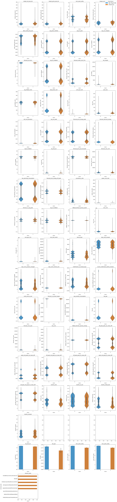
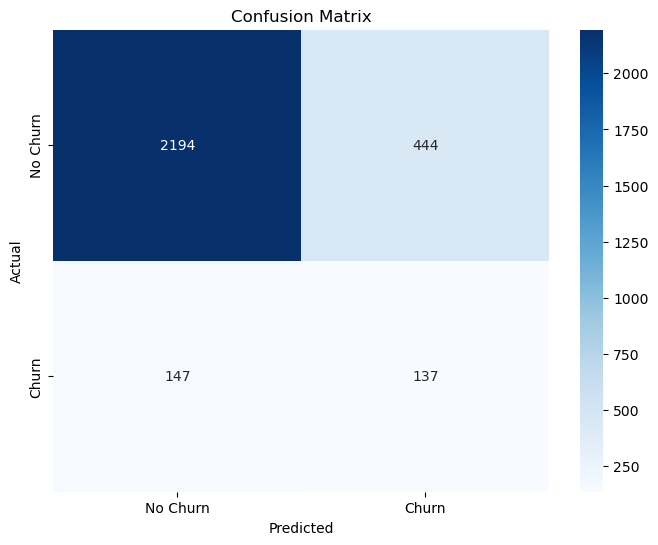
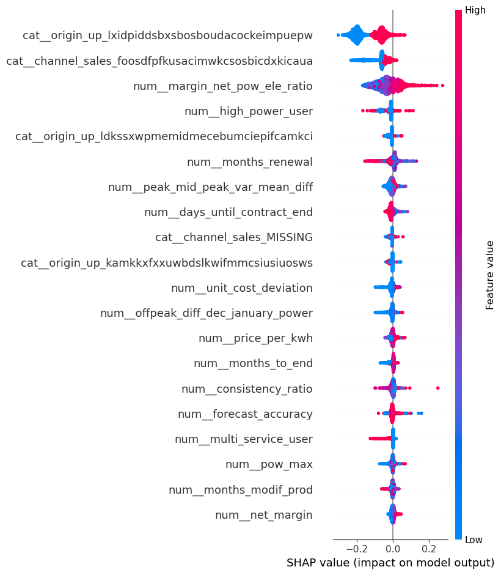
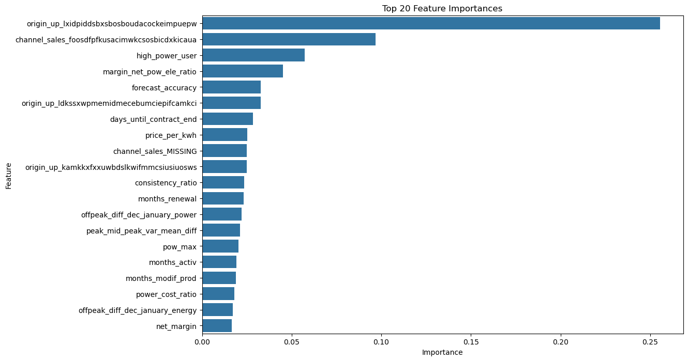

# PowerCo SME Customer Churn Prediction

## ✨ Executive Summary

PowerCo, a major energy utility, aims to proactively reduce churn among its Small and Medium Enterprise (SME) customers. This project developed a data-driven predictive model using customer and pricing data to identify SMEs at high risk of churning. The final model achieves a **recall of 48%** and an **ROC AUC of 0.70**, providing actionable insights to guide retention strategies.

---

## 🔎 Business Problem

PowerCo has observed increased customer attrition, particularly in the SME segment. Given the high acquisition costs and revenue contributions of SME clients, retaining these customers is essential to preserving profitability. However, without a reliable churn prediction framework, PowerCo lacks the means to prioritize intervention efforts effectively.
> 

### Objectives

* Predict churn risk among SME customers using historical data
* Identify key drivers of churn for business intervention
* Enable targeted retention strategies to reduce revenue leakage

---

## ⚖️ Methodology

### 1. **Data Understanding & Preparation**

* **Sources**: Two datasets from Forage (Client and Price data)
* Merged based on `id`, using group-level price aggregation and engineered pricing features
* Handled missing values, date parsing, and outlier detection

### 2. **Feature Engineering**

* Created over 20 features including:

  * Net and gross margin ratios
  * Temporal contract and modification features
  * Volatility and usage flags
  * Off-peak price differences (Dec vs Jan)
* Applied domain-driven logic to ensure features reflect business conditions pre-churn.
>

### 3. **Modeling Pipeline**

* **Pipeline Components**:

  * ColumnTransformer: Imputation + OneHotEncoding (for `channel_sales`, `origin_up`)
  * SMOTE: Oversampling to balance class distribution
  * Random Forest Classifier: Tuned using RandomizedSearchCV

```python
RandomForestClassifier(
    class_weight='balanced',
    criterion='entropy',
    max_depth=20,
    max_features=None,
    min_samples_leaf=2,
    min_samples_split=3,
    n_estimators=655,
    random_state=42
)
```

---

## ⚖️ Model Performance

| Metric         | Value |
| -------------- | ----- |
| **Recall (1)** | 0.48  |
| Precision (1)  | 0.24  |
| F1-score (1)   | 0.32  |
| Accuracy       | 0.80  |
| ROC AUC        | 0.70  |

>

**Interpretation**: While precision is moderate, the model's high recall aligns with the business need to **maximize churn detection** and prioritize outreach.

---

## 🌐 SHAP Feature Importance

The SHAP analysis reveals the top drivers of churn:

>
>

* Low `margin_net_pow_ele_ratio`
* Customers with short `months_to_end` or low `months_renewal`
* Off-peak pricing shifts (`offpeak_diff_dec_january_power`)
* Certain acquisition channels and sales origins

---

## ⚠️ Challenges Encountered

* High class imbalance: <11% churn rate addressed via SMOTE
* Complex feature space with overlapping economic indicators
* One-hot encoding led to feature explosion; managed through pipeline abstraction

---

## ✅ Business Value Delivered

* Enables **early identification of churners** with high confidence
* Improves **resource allocation** for retention (e.g., discounts, outreach)
* Provides **interpretability** via SHAP, aligning model logic with business intuition

---

## 🤖 Next Steps / Future Plans

* Deploy as a **real-time churn scoring API** for PowerCo CRM
* Test threshold-based segmentation (e.g., top 10% at-risk customers)
* Integrate additional signals: call logs, service complaints, NPS surveys
* Explore uplift modeling to prioritize **actionable churners**
* Extend modeling to **residential customers**

---

## 📃 Project Structure

```text
powerco-customer-churn/
├── Data/
│   ├── client_data.csv
│   ├── price_data.csv
│   ├── cleaned_data.csv
│   ├── engineered_df.csv
│   └── Data Description.docx
├── Notebooks/
│   ├── data_preprocessing.ipynb
│   ├── FeatureEngineering.ipynb
│   ├── Modeling.ipynb
├── Scripts/
│   └── [custom modules, pipeline components]
├── outputs/
│   ├── Shap_Importance.png
│   ├── cm.png
│   ├── Feature_Enginereing.png
│   ├── Feature_Importance.png
│   └── Churn Distribution.png
├── README.md
└── requirements.txt
```

---


